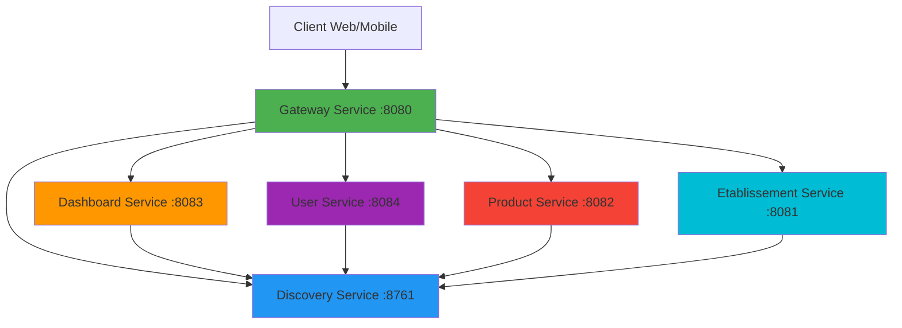
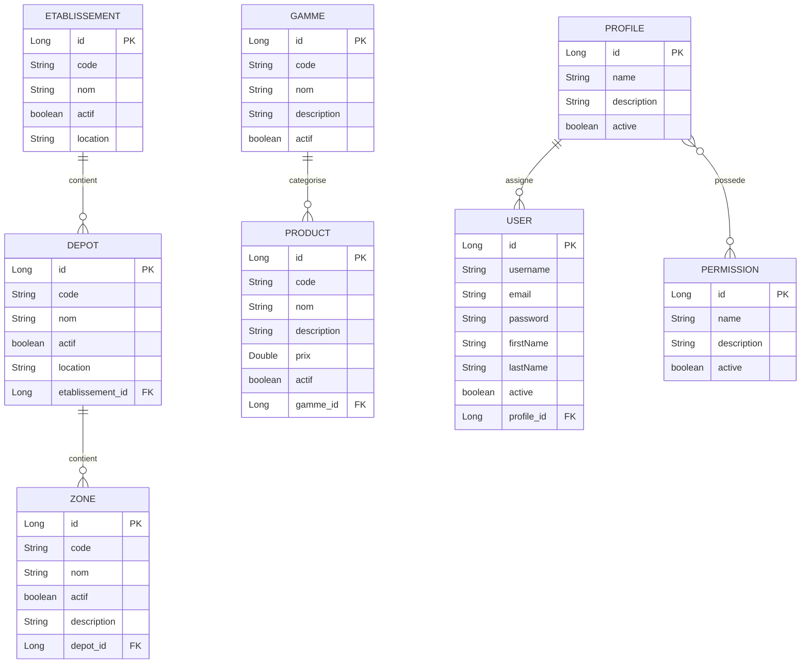

# 📦 Trace - Système de Gestion de Traçabilité


## 📋 Table des Matières

- [Vue d'ensemble](#-vue-densemble)
- [Architecture](#-architecture)
- [Microservices](#-microservices)
- [Technologies](#-technologies)
- [Prérequis](#-prérequis)
- [Installation](#-installation)
- [Démarrage](#-démarrage)
- [Accès aux Services](#-accès-aux-services)
- [Structure du Projet](#-structure-du-projet)
- [Modèle de Données](#-modèle-de-données)
- [Fonctionnalités](#-fonctionnalités)
- [Développement](#-développement)
- [Roadmap](#-roadmap)

## 🎯 Vue d'ensemble

**Trace** est une application de gestion de traçabilité basée sur une architecture microservices. Elle permet de gérer les établissements, les dépôts, les zones de stockage, les produits et les utilisateurs dans un environnement distribué et scalable.

Le système est conçu pour offrir une solution complète de gestion logistique avec :
- ✅ Gestion hiérarchique des établissements, dépôts et zones
- ✅ Gestion des produits et gammes
- ✅ Système de gestion des utilisateurs avec profils et permissions
- ✅ Interface web moderne avec AdminLTE 3
- ✅ Architecture microservices découplée et évolutive

## 🏗️ Architecture

Le projet utilise une architecture microservices avec les composants suivants :



### Principes Architecturaux

- **Service Discovery** : Eureka pour l'enregistrement et la découverte des services
- **API Gateway** : Point d'entrée unique pour tous les clients
- **Microservices indépendants** : Chaque service a sa propre base de données et logique métier
- **Communication REST** : APIs RESTful pour la communication inter-services
- **Interface Web** : Thymeleaf avec AdminLTE 3 pour une interface moderne

## 🔧 Microservices

### 1. Discovery Service (Port 8761)
**Rôle** : Service de découverte Eureka pour l'enregistrement et la localisation des microservices.

**Fonctionnalités** :
- Enregistrement automatique des services
- Health checks
- Load balancing
- Dashboard Eureka

**Technologies** :
- Spring Cloud Netflix Eureka Server
- Spring Boot Actuator

---

### 2. Gateway Service (Port 8080)
**Rôle** : Point d'entrée unique pour toutes les requêtes clients, routage et équilibrage de charge.

**Fonctionnalités** :
- Routage dynamique vers les microservices
- Load balancing
- Filtrage des requêtes
- Gestion centralisée de la sécurité

**Technologies** :
- Spring Cloud Gateway
- Spring Boot Web
- Thymeleaf

**Routes** :
- `/` → Dashboard Service
- `/users/**` → User Service
- `/products/**` → Product Service
- `/etablissements/**` → Etablissement Service
- `/depots/**` → Etablissement Service
- `/emplacements/**` → Etablissement Service

---

### 3. Dashboard Service (Port 8083)
**Rôle** : Interface principale de tableau de bord et page d'accueil de l'application.

**Fonctionnalités** :
- Page d'accueil avec statistiques
- Navigation centralisée
- Vue d'ensemble du système
- Interface AdminLTE 3

**Technologies** :
- Spring Boot Web
- Thymeleaf
- AdminLTE 3
- Spring Cloud Eureka Client

---

### 4. User Service (Port 8084)
**Rôle** : Gestion complète des utilisateurs, profils et permissions.

**Fonctionnalités** :
- CRUD des utilisateurs
- Gestion des profils (rôles)
- Gestion des permissions
- Authentification et autorisation
- Association utilisateur-dépôt

**Entités** :
- **User** : Utilisateurs du système
  - `id`, `username`, `email`, `password`
  - `firstName`, `lastName`, `active`
  - `profile` (relation ManyToOne)
  - `createdAt`, `updatedAt`

- **Profile** : Rôles/Profils utilisateur
  - `id`, `name`, `description`, `active`
  - `permissions` (relation ManyToMany)
  - `createdAt`, `updatedAt`

- **Permission** : Permissions granulaires
  - `id`, `name`, `description`, `active`
  - `createdAt`, `updatedAt`

**APIs REST** :
- `GET/POST /users` - Liste et création
- `GET/PUT/DELETE /users/{id}` - Détails, modification, suppression
- `GET/POST /profiles` - Gestion des profils
- `GET/POST /permissions` - Gestion des permissions

**Technologies** :
- Spring Boot Web + Data JPA
- H2 Database (dev)
- Lombok
- Thymeleaf + AdminLTE 3

---

### 5. Product Service (Port 8082)
**Rôle** : Gestion des produits et des gammes de produits.

**Fonctionnalités** :
- CRUD des produits
- Gestion des gammes
- Classification des produits
- Gestion des caractéristiques produits

**Entités** :
- **Product** : Produits
  - `id`, `code`, `nom`, `description`, `prix`
  - `rang`, `idTypePalPro`, `unibase`, `upal`, `ucas`
  - `actif`, `minqu`, `maxqu`, `peremption`, `grammage`
  - `gamme` (relation ManyToOne)

- **Gamme** : Gammes de produits
  - `id`, `code`, `nom`, `description`, `actif`
  - `products` (relation OneToMany)

**APIs REST** :
- `GET/POST /products` - Liste et création
- `GET/PUT/DELETE /products/{id}` - Détails, modification, suppression
- `GET/POST /gammes` - Gestion des gammes

**Technologies** :
- Spring Boot Web + Data JPA
- H2 Database (dev)
- Lombok
- Thymeleaf + AdminLTE 3

---

### 6. Etablissement Service (Port 8081)
**Rôle** : Gestion des établissements, dépôts et zones de stockage (emplacements).

**Fonctionnalités** :
- CRUD des établissements
- CRUD des dépôts
- CRUD des zones/emplacements
- Gestion hiérarchique (Etablissement → Dépôt → Zone)

**Entités** :
- **Etablissement** : Établissements
  - `id`, `code`, `nom`, `actif`, `location`
  - `depots` (relation OneToMany)

- **Depot** : Dépôts
  - `id`, `code`, `nom`, `actif`, `location`
  - `etablissement` (relation ManyToOne)
  - `zones` (relation OneToMany)

- **Zone** : Zones/Emplacements
  - `id`, `code`, `nom`, `actif`, `description`
  - `depot` (relation ManyToOne)

**APIs REST** :
- `GET/POST /etablissements` - Liste et création
- `GET/PUT/DELETE /etablissements/{id}` - Détails, modification, suppression
- `GET/POST /depots` - Gestion des dépôts
- `GET/POST /emplacements` - Gestion des zones

**Technologies** :
- Spring Boot Web + Data JPA
- H2 Database (dev)
- Thymeleaf + AdminLTE 3

## 💻 Technologies

### Backend
| Technologie | Version | Usage |
|------------|---------|-------|
| Java | 17 | Langage principal |
| Spring Boot | 3.4.0 | Framework applicatif |
| Spring Cloud | 2024.0.0 | Microservices |
| Spring Data JPA | 3.4.0 | Persistence |
| H2 Database | - | Base de données (dev) |
| Lombok | - | Réduction du code boilerplate |
| Maven | - | Gestion des dépendances |

### Frontend
| Technologie | Version | Usage |
|------------|---------|-------|
| Thymeleaf | - | Moteur de templates |
| AdminLTE | 3 | Framework UI |
| Bootstrap | 4.6 | Framework CSS |
| jQuery | 3.6 | Bibliothèque JavaScript |
| Font Awesome | 5.15 | Icônes |

### Infrastructure
| Technologie | Usage |
|------------|-------|
| Netflix Eureka | Service Discovery |
| Spring Cloud Gateway | API Gateway |
| Spring Boot Actuator | Monitoring |

## 📦 Prérequis

- **Java JDK** 17 ou supérieur
- **Maven** 3.6+ (ou utiliser le wrapper Maven inclus)
- **Git** pour cloner le repository
- **Navigateur web** moderne (Chrome, Firefox, Edge)
- **Ports disponibles** : 8080, 8081, 8082, 8083, 8084, 8761

## 🚀 Installation

### 1. Cloner le repository

```bash
git clone https://github.com/mejdoumo/Trace.git
cd Trace
```

### 2. Compiler le projet

```bash
cd "Backoffice&Backend"
mvn clean install
```

Cette commande va :
- Télécharger toutes les dépendances
- Compiler tous les microservices
- Exécuter les tests
- Créer les fichiers JAR

## ▶️ Démarrage

### Option 1 : Démarrage automatique (Windows)

Utilisez le script batch fourni pour démarrer tous les services :

```bash
start_all.bat
```

Ce script va :
1. Arrêter tous les services en cours sur les ports utilisés
2. Démarrer les services dans l'ordre optimal :
   - Discovery Service (60s d'attente)
   - Gateway Service (10s d'attente)
   - Dashboard Service (10s d'attente)
   - User Service (10s d'attente)
   - Product Service (10s d'attente)
   - Etablissement Service (30s d'attente)

### Option 2 : Démarrage manuel

Démarrer chaque service dans l'ordre suivant :

```bash
# 1. Discovery Service
cd discovery-service
mvn spring-boot:run

# 2. Gateway Service (attendre 60s)
cd ../gateway-service
mvn spring-boot:run

# 3. Dashboard Service (attendre 10s)
cd ../dashboard-service
mvn spring-boot:run

# 4. User Service (attendre 10s)
cd ../user-service
mvn spring-boot:run

# 5. Product Service (attendre 10s)
cd ../product-service
mvn spring-boot:run

# 6. Etablissement Service (attendre 10s)
cd ../etablissement-service
mvn spring-boot:run
```

### Arrêt des services

```bash
stop_all.bat
```

## 🌐 Accès aux Services

Une fois tous les services démarrés :

| Service | URL | Description |
|---------|-----|-------------|
| **Dashboard** | http://localhost:8080/ | Page d'accueil principale |
| **Eureka Dashboard** | http://localhost:8761 | Console de découverte des services |
| **Users** | http://localhost:8080/users | Gestion des utilisateurs |
| **Products** | http://localhost:8080/products | Gestion des produits |
| **Etablissements** | http://localhost:8080/etablissements | Gestion des établissements |
| **Dépôts** | http://localhost:8080/depots | Gestion des dépôts |
| **Emplacements** | http://localhost:8080/emplacements | Gestion des zones |

### Accès direct aux microservices (dev)

| Service | URL |
|---------|-----|
| Dashboard Service | http://localhost:8083 |
| User Service | http://localhost:8084/users |
| Product Service | http://localhost:8082/products |
| Etablissement Service | http://localhost:8081/etablissements |

## 📁 Structure du Projet

```
Trace/
├── Backoffice&Backend/          # Backend microservices
│   ├── discovery-service/       # Service de découverte Eureka
│   ├── gateway-service/         # API Gateway
│   ├── dashboard-service/       # Service de tableau de bord
│   ├── user-service/            # Service de gestion des utilisateurs
│   ├── product-service/         # Service de gestion des produits
│   ├── etablissement-service/   # Service de gestion des établissements
│   ├── data/                    # Données persistantes (H2)
│   ├── logs/                    # Fichiers de logs
│   └── pom.xml                  # POM parent Maven
├── Mobile/                      # Application mobile (à venir)
├── logs/                        # Logs globaux
├── start_all.bat               # Script de démarrage
├── stop_all.bat                # Script d'arrêt
├── TODO.md                     # Liste des tâches
└── README.md                   # Ce fichier
```

### Structure d'un microservice type

```
service-name/
├── src/
│   ├── main/
│   │   ├── java/
│   │   │   └── com/trace/[domain]/
│   │   │       ├── controller/      # Contrôleurs REST et Web
│   │   │       ├── entity/          # Entités JPA
│   │   │       ├── repository/      # Repositories Spring Data
│   │   │       ├── service/         # Logique métier
│   │   │       └── Application.java # Classe principale
│   │   └── resources/
│   │       ├── application.properties  # Configuration
│   │       ├── static/                 # Ressources statiques
│   │       └── templates/              # Templates Thymeleaf
│   └── test/                    # Tests unitaires
└── pom.xml                      # Configuration Maven
```

## 🗄️ Modèle de Données

### Relations entre entités



## ✨ Fonctionnalités

### ✅ Fonctionnalités Implémentées

#### Gestion des Établissements
- [x] Liste des établissements avec pagination
- [x] Création d'établissement
- [x] Modification d'établissement
- [x] Suppression d'établissement
- [x] Activation/désactivation
- [x] Interface AdminLTE 3

#### Gestion des Dépôts
- [x] Liste des dépôts avec pagination
- [x] Création de dépôt
- [x] Modification de dépôt
- [x] Suppression de dépôt
- [x] Association à un établissement
- [x] Champ actif
- [x] Interface AdminLTE 3

#### Gestion des Zones/Emplacements
- [x] Liste des zones avec pagination
- [x] Création de zone
- [x] Modification de zone
- [x] Suppression de zone
- [x] Association à un dépôt
- [x] Interface AdminLTE 3

#### Gestion des Produits
- [x] Liste des produits avec pagination
- [x] Création de produit
- [x] Modification de produit
- [x] Suppression de produit
- [x] Gestion des gammes
- [x] Caractéristiques avancées (grammage, péremption, etc.)
- [x] Interface AdminLTE 3

#### Gestion des Utilisateurs
- [x] Liste des utilisateurs
- [x] Création d'utilisateur
- [x] Modification d'utilisateur
- [x] Suppression d'utilisateur
- [x] Gestion des profils (rôles)
- [x] Gestion des permissions
- [x] Interface AdminLTE 3

#### Infrastructure
- [x] Service Discovery (Eureka)
- [x] API Gateway
- [x] Dashboard centralisé
- [x] Navigation cohérente entre services
- [x] Scripts de démarrage/arrêt automatiques

### 🚧 Fonctionnalités en Développement

- [ ] Application mobile (Angular/Ionic)
- [ ] Authentification JWT
- [ ] Gestion des stocks
- [ ] Traçabilité des mouvements
- [ ] Rapports et statistiques
- [ ] Export de données (PDF, Excel)
- [ ] Notifications en temps réel
- [ ] API REST complète pour mobile

## 👨‍💻 Développement

### Ajouter un nouveau microservice

1. Créer un nouveau module Maven dans `Backoffice&Backend/`
2. Ajouter le module au `pom.xml` parent
3. Configurer les dépendances Spring Cloud
4. Enregistrer le service dans Eureka
5. Ajouter les routes dans le Gateway
6. Mettre à jour `start_all.bat`

### Conventions de code

- **Packages** : `com.trace.[domain].[layer]`
- **Entités** : PascalCase, annotations Lombok
- **Controllers** : Suffixe `Controller` ou `RestController`
- **Services** : Suffixe `Service`
- **Repositories** : Suffixe `Repository`
- **Templates** : kebab-case (ex: `user-list.html`)

### Base de données

En développement, chaque service utilise H2 en mode fichier :
- Données stockées dans `Backoffice&Backend/data/`
- Console H2 accessible via `/h2-console`
- Configuration dans `application.properties`

### Logs

Les logs sont stockés dans :
- `Backoffice&Backend/logs/` - Logs par service
- `logs/` - Logs globaux

## 🗺️ Roadmap

### Phase 1 : Backend Core ✅ (Complétée)
- [x] Architecture microservices
- [x] Service Discovery
- [x] API Gateway
- [x] Services métier de base
- [x] Interface web AdminLTE

### Phase 2 : Sécurité 🔄 (En cours)
- [ ] Authentification JWT
- [ ] Autorisation basée sur les rôles
- [ ] Chiffrement des mots de passe
- [ ] Session management
- [ ] CORS configuration

### Phase 3 : Fonctionnalités Avancées
- [ ] Gestion des stocks
- [ ] Traçabilité des mouvements
- [ ] Alertes et notifications
- [ ] Rapports personnalisés
- [ ] Dashboard analytics
- [ ] Import/Export de données

### Phase 4 : Application Mobile
- [ ] Application Angular/Ionic
- [ ] Synchronisation offline
- [ ] Scanner de codes-barres
- [ ] Géolocalisation
- [ ] Notifications push

### Phase 5 : Production
- [ ] Migration vers PostgreSQL
- [ ] Configuration Docker
- [ ] CI/CD Pipeline
- [ ] Monitoring (Prometheus/Grafana)
- [ ] Documentation API (Swagger)
- [ ] Tests d'intégration

## 📝 Notes de Version

### Version 0.0.1-SNAPSHOT (Actuelle)

**Date** : Décembre 2025

**Nouveautés** :
- ✨ Architecture microservices complète
- ✨ 6 microservices opérationnels
- ✨ Interface AdminLTE 3 moderne
- ✨ Gestion complète des entités métier
- ✨ Scripts de démarrage automatiques
- ✨ Navigation unifiée entre services

**Améliorations récentes** :
- Ajout du champ `actif` sur Etablissement et Depot
- Refactorisation des URLs pour les emplacements
- Amélioration de la navigation sidebar
- Boutons de création rapide sur les listes
- Gestion des profils et permissions

## 🤝 Contribution

Ce projet est en développement actif. Pour contribuer :

1. Fork le projet
2. Créer une branche feature (`git checkout -b feature/AmazingFeature`)
3. Commit les changements (`git commit -m 'Add AmazingFeature'`)
4. Push vers la branche (`git push origin feature/AmazingFeature`)
5. Ouvrir une Pull Request

## 📄 Licence

Ce projet est sous licence privée. Tous droits réservés.

## 📧 Contact

**Projet** : Trace - Système de Gestion de Traçabilité  
**Repository** : https://github.com/mejdoumo/Trace

---

**Dernière mise à jour** : 29 Décembre 2025  
**Statut** : 🟢 En développement actif
