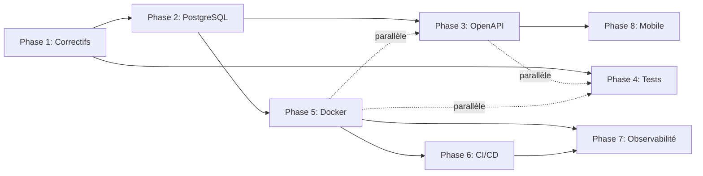

# Roadmap Trace — Plan de Finalisation CTO

> **Version cible** : 1.0.0 | **Horizon** : 18-20 semaines
> **Périmètre** : Complet (backend + mobile)
> **Basé sur l'audit** : cf. `ANALYSE.md`

---

## Parcours de décision

| Décision | Choix |
|---|---|
| Périmètre | **C — Complet avec mobile** (18-20 sem) |
| Migration DB | **Flyway** (SQL pur) |
| Framework mobile | **Angular/Ionic** (conservé) |

---

## Phase 1 — Correctifs de sécurité critiques

**Durée** : 2 semaines | **Priorité** : 🔴 Haute

| # | Tâche | Service | Effort |
|---|---|---|---|
| 1.1 | Ajouter `@PreAuthorize` sur toutes les méthodes de `UserRestController` | user-service | 1j |
| 1.2 | Ajouter `@PreAuthorize` sur `HealthCheckController` | dashboard-service | 0.5j |
| 1.3 | Ajouter `@EnableDiscoveryClient` sur les 5 services clients | gateway, dashboard, user, product, etablissement | 1j |
| 1.4 | Corriger les ports erronés dans `DashboardController` (product → 8082, dashboard → 8083) | dashboard-service | 0.5j |
| 1.5 | Fusionner `GlobalAuthFilter` + `JwtGatewayFilter` en un seul mécanisme | gateway-service | 1j |
| 1.6 | Ajouter support cookie dans `JwtRequestFilter` (product, dashboard) | product-service, dashboard-service | 1j |
| 1.7 | Nettoyer `application-prod.yml` du discovery-service (copier-coller aberrant) | discovery-service | 0.5j |
| 1.8 | Créer `application-prod.yml` manquant | etablissement-service | 0.5j |
| 1.9 | Ajouter `.gitignore` (target/, *.jar, data/, logs/, .idea/, .vscode/) | root | 0.5j |

**Tests à ajouter** : Vérifier que chaque endpoint non autorisé retourne 401/403.

---

## Phase 2 — Base de données production

**Durée** : 2 semaines | **Prérequis** : Phase 1

| # | Tâche | Détail | Effort |
|---|---|---|---|
| 2.1 | Ajouter `postgresql` driver dans chaque POM | 7 services | 1j |
| 2.2 | Configurer `application-prod.yml` avec PostgreSQL réel (URL, credentials, dialecte) | 6 services | 1j |
| 2.3 | Créer scripts Flyway V1 (création des tables, seed data) pour chaque service | 6 services | 3j |
| 2.4 | Intégrer Flyway dans chaque POM + config Spring | 6 services | 1j |
| 2.5 | Convertir les `import.sql` et `DataInitializer.java` en migrations Flyway | user-service | 1j |
| 2.6 | Tester la migration complète (H2 existant → PostgreSQL) | Tous | 2j |
| 2.7 | Ajouter `application-docker.yml` optionnel | Tous | 1j |

**Choix technique** : Flyway (SQL pur, simple, intégration Spring Boot native).

---

## Phase 3 — API Documentation & Cleanup

**Durée** : 2 semaines | **Prérequis** : Phase 2

| # | Tâche | Détail | Effort |
|---|---|---|---|
| 3.1 | Ajouter `springdoc-openapi-starter-webmvc-ui` dans chaque POM | 6 services | 1j |
| 3.2 | Annoter les endpoints REST avec `@Operation` + `@ApiResponse` | Tous les REST controllers | 3j |
| 3.3 | Centraliser Swagger UI sur le gateway (`springdoc.swagger-ui.urls`) | gateway-service | 1j |
| 3.4 | Créer un module `common` partagé (énums dupliquées, DTOs, constantes) | Nouveau module Maven | 2j |
| 3.5 | Extraire `TypeGestion`, `TypePalette` et classes partagées vers `common` | product + etablissement | 1j |
| 3.6 | Supprimer le `SwaggerConfig.java` vide | product-service | 0.5j |

**Note** : Parallélisable avec la Phase 4.

---

## Phase 4 — Tests

**Durée** : 3 semaines | **Prérequis** : Phase 1

| # | Tâche | Détail | Effort |
|---|---|---|---|
| 4.1 | Tests unitaires `EtablissementService` | etablissement-service | 2j |
| 4.2 | Tests unitaires `DashboardController` + `HealthCheckController` | dashboard-service | 1j |
| 4.3 | Tests unitaires `AuthController` (login valide/invalide, logout) | auth-service | 1j |
| 4.4 | Tests d'intégration REST (`@WebMvcTest`) pour chaque contrôleur | Tous les services | 5j |
| 4.5 | Tests de sécurité automatisés (403 attendus sur endpoints non autorisés) | Tous les services | 2j |
| 4.6 | Compléter `ProductRestControllerIntegrationTest` (fichier vide) | product-service | 1j |
| 4.7 | Tests bout en bout (login → CRUD établissement → CRUD produit) | Cross-service | 3j |

**Parallélisable** avec Phase 3.

---

## Phase 5 — Conteneurisation

**Durée** : 2 semaines | **Prérequis** : Phase 2

| # | Tâche | Détail | Effort |
|---|---|---|---|
| 5.1 | Créer 7 Dockerfiles (base `eclipse-temurin:17-jre-slim`, multi-stage) | Chaque service | 2j |
| 5.2 | Créer `docker-compose.yml` complet (7 services + 6 PostgreSQL) | Root | 2j |
| 5.3 | Configurer les health checks Docker pour l'ordre de démarrage | docker-compose | 1j |
| 5.4 | Ajouter `.dockerignore` | Root | 0.5j |
| 5.5 | Tester `docker compose up` (vérifier que tout tourne) | — | 3j |

**Parallélisable** avec Phases 3 et 4.

---

## Phase 6 — CI/CD

**Durée** : 2 semaines | **Prérequis** : Phase 5

| # | Tâche | Détail | Effort |
|---|---|---|---|
| 6.1 | Pipeline CI : `mvn verify` sur chaque PR (compile + tests) | GitHub Actions | 2j |
| 6.2 | Pipeline CI : analyse SonarCloud (qualité + sécurité) | GitHub Actions | 1j |
| 6.3 | Pipeline CD : build Docker → push registry → déploiement staging | GitHub Actions | 3j |
| 6.4 | Scan vulnérabilités dépendances (`mvn dependency-check`) | GitHub Actions | 1j |

---

## Phase 7 — Observabilité & Production

**Durée** : 2 semaines | **Prérequis** : Phase 5

| # | Tâche | Détail | Effort |
|---|---|---|---|
| 7.1 | Health checks personnalisés (DB, Eureka, dépendances) | Tous les services | 2j |
| 7.2 | Métriques Micrometer + endpoint Prometheus | Tous les services | 2j |
| 7.3 | Logging structuré JSON (Logstash encoder) | Tous les services | 1j |
| 7.4 | Rate limiting sur le gateway (Spring Cloud Gateway RequestRateLimiter) | gateway-service | 1j |
| 7.5 | Config CORS propre | gateway-service | 0.5j |
| 7.6 | Audit dépendances final (OWASP) | Global | 1j |
| 7.7 | Runbook d'exploitation (procédures start/stop, backup, restore, incident) | Documentation | 2j |

---

## Phase 8 — Application mobile

**Durée** : 6 semaines | **Prérequis** : Phase 3 (API stable)

| # | Tâche | Détail | Effort |
|---|---|---|---|
| 8.1 | Initialiser projet Ionic/Angular avec Capacitor | `Mobile/` | 1j |
| 8.2 | Page de login (appel auth-service via gateway) | Mobile | 3j |
| 8.3 | Scan code-barres (plugin Capacitor Camera/BarcodeScanner) | Mobile | 3j |
| 8.4 | Consultation des produits et établissements (API existante) | Mobile | 5j |
| 8.5 | Synchronisation offline (PouchDB + CouchDB ou équivalent) | Mobile | 5j |
| 8.6 | Géolocalisation pour inventaire terrain | Mobile | 3j |
| 8.7 | Tests mobile (Android + iOS si possible) | Mobile | 5j |

---

## Calendrier prévisionnel

```
Sem 1-2   ▸ Phase 1 : Correctifs sécurité critiques
Sem 3-4   ▸ Phase 2 : PostgreSQL + Flyway
Sem 5-6   ▸ Phase 3 : OpenAPI/Swagger + common module
Sem 5-7   ▸ Phase 4 : Tests (parallèle avec Ph3)
Sem 7-8   ▸ Phase 5 : Docker + docker-compose
Sem 9-10  ▸ Phase 6 : CI/CD (GitHub Actions)
Sem 11-12 ▸ Phase 7 : Monitoring, logging, runbook
Sem 13-18 ▸ Phase 8 : Application mobile Ionic
Sem 19-20 ▸ Buffer + recette + déploiement
```

**Équipe recommandée** : 3 devs backend + 2 devs mobile (à partir de la semaine 13)

---

## Dépendances entre phases



---

## Risques et mitigation

| Risque | Probabilité | Impact | Mitigation |
|---|---|---|---|
| Migration H2→PostgreSQL casse des requêtes | Moyenne | Haut | Tester avec les données seed existantes ; corriger les dialectes SQL |
| Services ne démarrent pas dans l'ordre (Docker) | Haute | Moyen | Health checks + dépendances docker-compose + wait-for-it.sh |
| Perte de données dev existantes (H2 files) | Haute | Moyen | Sauvegarder `data/` avant migration ; documenter la procédure |
| JWT secret en dur dans le code | Faible (déjà externalisé) | Critique | Vérifier chaque commit avec un scan (truffleHog, git secrets) |
| Breaking changes API pour le mobile | Moyenne | Haut | Versionner l'API dès la phase 3 (préfixe `/api/v1/`) |

---

## Métriques de succès

| Indicateur | Cible Complète |
|---|---|
| Couverture de tests | > 70 % |
| Temps de démarrage complet | < 30s (optimisé) |
| Vulnérabilités connues | 0 toutes |
| Downtime planifié | < 5 min/mois |
| Documentation API | OpenAPI complet + Swagger UI |
| Build CI | < 10 min |
